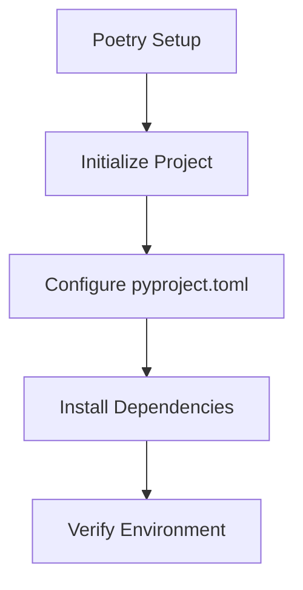
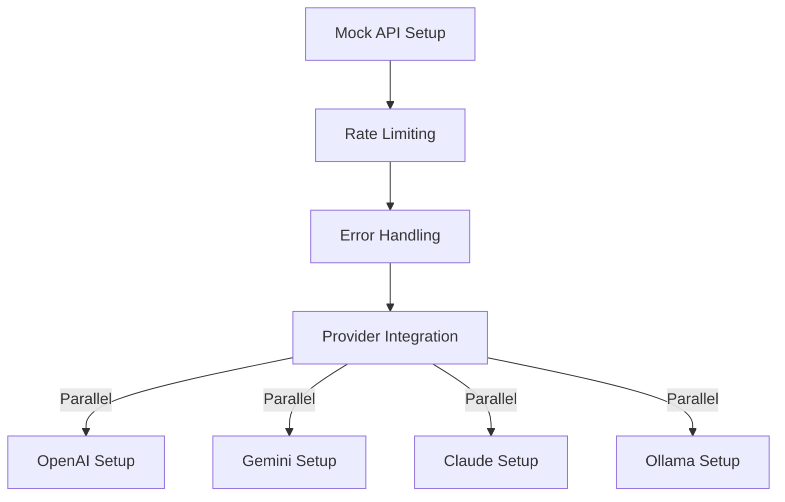
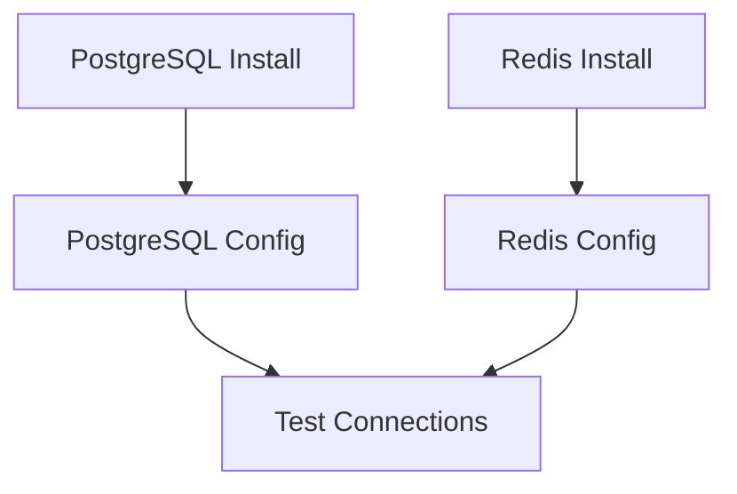
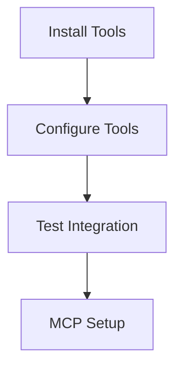

# Implementation Plan

## 1. Virtual Environment Setup (Priority)

### Steps:
1. Verify Poetry installation
2. Configure pyproject.toml with:
   - Python 3.11 requirement
   - Development dependencies (pytest, black, isort, mypy, flake8)
   - Production dependencies (Django, Langgraph, LangChain, Pydantic)
3. Install all dependencies in virtual environment

## 2. LLM Integration

### Steps:
1. Create mock API infrastructure
2. Implement rate limiting for all providers
3. Set up error handling templates
4. Configure providers with mock credentials
5. Install and configure Ollama
6. Set up deepseek-r1 model (8b)

## 3. Database Layer

### Steps:
1. Direct PostgreSQL installation
2. Basic PostgreSQL configuration
3. Redis installation and setup
4. Configure connection settings
5. Implement connection tests

## 4. Development Tools

### Steps:
1. Install and configure Pydantic
2. Set up Sourcegraph extension
3. Configure initial MCP server
4. Implement MCP management tools

## Testing Strategy
- Unit tests after each major component
- Integration tests for database connections
- Mock API tests
- Environment verification tests

IMPOORTANT: All installations is on Virtual environment, dependencies managed by POETRY

Would you like me to proceed with creating the required configuration files and switch to Code mode for implementation?